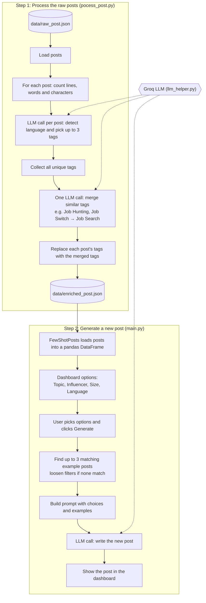

# PostPilot AI

PostPilot AI generates LinkedIn posts in the style of well-known influencers. You pick a topic, an influencer, a post size and a language, and it writes a new post using that influencer's past posts as examples.

It uses [Groq](https://groq.com) for the LLM and [Streamlit](https://streamlit.io) for the dashboard.

## How it works

The project runs in two steps.



### Step 1: Process the raw posts

[process_data/pocess_post.py](process_data/pocess_post.py) reads the raw posts from `data/raw_post.json` and adds metadata to each one:

- **Counts:** line count, word count and character count.
- **Language:** `English` or `Hinglish` (Hindi mixed with English), detected by the LLM.
- **Tags:** up to 3 topic tags per post, picked by the LLM.

The LLM then merges tags that mean the same thing. For example, "Job Hunting", "Job Switch" and "Job Search" all become "Job Search", so similar posts share one tag.

The processed posts are saved to `data/enriched_post.json`.

### Step 2: Generate new posts

[main.py](main.py) is the Streamlit dashboard. It reads `data/enriched_post.json` and fills its options from that data:

- **Topic:** every unique tag.
- **Influencer:** every author in the data.
- **Size:** Small (up to 50 words), Medium (51 to 150 words) or Big (more than 150 words).
- **Language:** English or Hinglish.

When you click **Generate**, it finds past posts that match your choices and sends them to the LLM as examples, so the new post matches that influencer's style. If no post matches every choice, it loosens the filters one at a time until it finds examples.

## Setup

1. Install [uv](https://docs.astral.sh/uv/) if you don't have it. The project uses Python 3.12.

2. Install the dependencies:

   ```bash
   uv sync
   ```

3. Get a free API key from [console.groq.com/keys](https://console.groq.com/keys), then create a `.env` file in the project root with:

   ```
   GROQ_API_KEY=your_groq_api_key
   ```

   `.env` is listed in `.gitignore`, so your key won't be committed.

That's all the setup you need.

## Running the project

Run both commands from the project root.

**Step 1: process the raw posts** (only needed when `data/raw_post.json` changes):

```bash
uv run python -m process_data.pocess_post
```

This makes one LLM call per post, plus one call to merge the tags. While testing, it only processes the first 21 posts, to stay within Groq's free-tier limits. Remove the limit in `process_posts()` to process every post.

**Step 2: start the dashboard:**

```bash
uv run streamlit run main.py
```

It opens in your browser at http://localhost:8501.

## Project structure

```
postpilot-ai/
├── data/
│   ├── raw_post.json         # input posts
│   └── enriched_post.json    # processed posts (created by step 1)
├── process_data/
│   └── pocess_post.py        # step 1: adds metadata and tags to the posts
├── few_shot_posts.py         # loads processed posts and filters them
├── llm_helper.py             # shared Groq LLM call
├── main.py                   # step 2: Streamlit dashboard and post generation
└── pyproject.toml
```

## About the sample data

The posts in `data/raw_post.json` are made-up examples written in the style of public figures. They are not real posts, and the engagement numbers are invented. Replace them with real data before using this for anything beyond testing.
